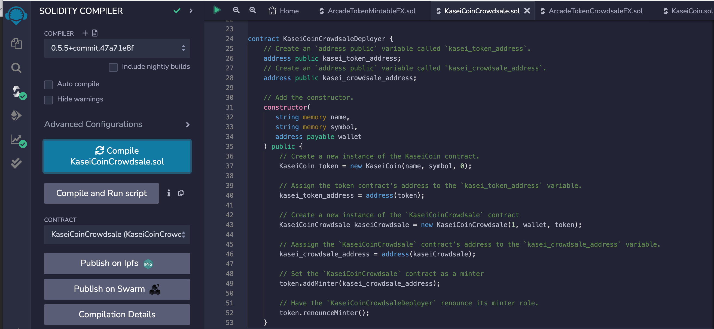

# KaseiCoin

We all know about "Dogecoin to the moon". Some scholars understand this to mean that Dogecoin will be the currency used in the future Moon colony. But what, you may ask, will be the currency used in the future Mars colony? KaseiCoin, of course! KaseiCoin (KSC) is a token on the Ethereum blockchain. The director of finance for this future colony can follow the instructions below to deploy a KaseiCoin crowdsale and sell tokens to colonizers and wise investors. 

1. Download the KaseiCoin.sol and KaseiCoinCrowdsale.sol files. Load these files into Remix IDE, and compile both files. 
2. In the Remix deployment panel, choose "Injected Provider - MetaMask" from the Environment drop-down menu. This should load MetaMask in Chrome, where you will select the accounts to connect to Remix IDE. Note: only one account will load into the "Account" drop-down menu in the Remix deployment panel even if you connect multiple Metamask accounts, and this one account will be charged the gas fees to deploy the crowdsale. To ensure the correct deployment account, connect only one account initially, and you can connect more accounts after deployment if necessary. (Alternatively, if you check multiple accounts in metamask to connect to Remix, the last account checked will be the one to populate the deployment account in Remix).
3. Still in the Remix deployment panel, select the KaseiCoinCrowdsaleDeployer contract from the Contracts drop-down menu. Populate the input fields (Name, Symbol, Wallet) with "KaseiCoin", "KSC", and the wallet address that will receive ETH for all token sales. Click the "transact" button. 
4. Next, deploy the KaseiCoin contract and the KaseiCoinCrowdsale contract. First, scroll down to the Deployed Contracts and find the KaseiCoinCrowdsaleDeployer contract. This should have two buttons: kasei_crowdsale_address, and kasei_token_address. Click each button to reveal these addresses. Copy the kasei_token_address, and scroll up to the Contracts drop-down menu, selecting the KaseiCoin contract. Beneath that is a button "At Address" and an input field; paste the kasei_token_address here, and click the "At Address" button. Repeat these steps with the kasei_crowdsale_address for the KaseiCoinCrowdsale contract.
5. Now you are ready to sell some tokens. Purchasers will need to import their account into the linked metamask and connect it to Remix. Back in Remix, at the top of the deployment panel is an input field "Value" next to a drop down menu that should display "wei" (other options are Gwei Finney, Ether. KaseiCoin tokens are rated 1:1 with wei, so make sure "wei" is selected for the value field to equal the amount of tokens to purchase). populate "Value" with the desired amount of tokens. Scroll down to the KaseiCoinCrowdsale deployed contract and find the red "buyTokens" button/input field, populate with the purchaser's address, and click. Purchasers can confirm their token balance by populating their address in the "balanceOf" input in the KaseiCoin deployed contract section. 
6. Accounts can also view their token balance in MetaMask. First, copy the KaseiCoin contract address in the deployed contracts in Remix. Navigate to Metamask and select the desired account. View "assets", and click "import tokens" at the bottom of the interface. This loads a section with an input field "token contract address". Paste the KaseiCoin contract address, and it should automatically populate the other inputs with "KaseiCoin" and "KSC". Click the "Add Custom Token" button, and now the account should display its KSC balance.

## Evaluation Evidence

KaseiCoin compiled

KaseCoinCrowdsale compiled

KaseCoinCrowdsaleDeployer Compiled

View final deployment of KaseiCoinCrowdsaleDeployer connected to metamask with Ganache accounts, purchase of tokens, BalanceOf, totalSupply, and weiRasied Here: [final_deployed.mov](./final_deployed.mov)
